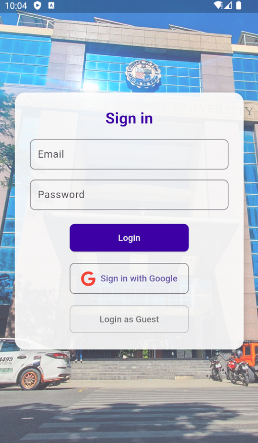
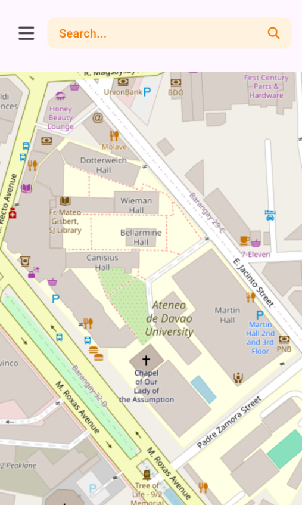
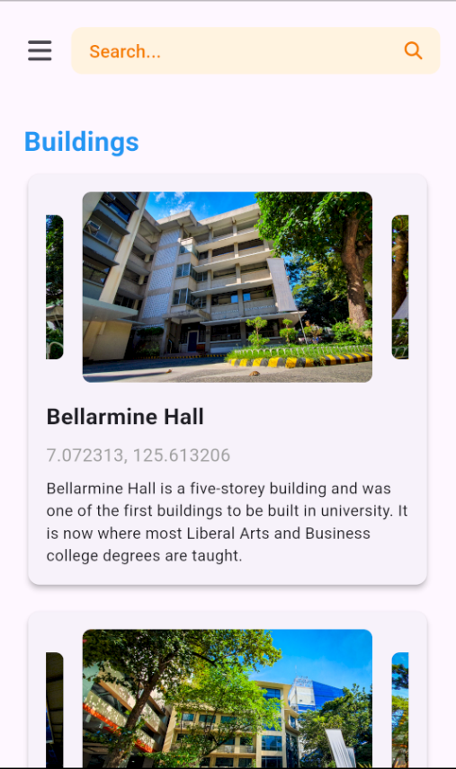
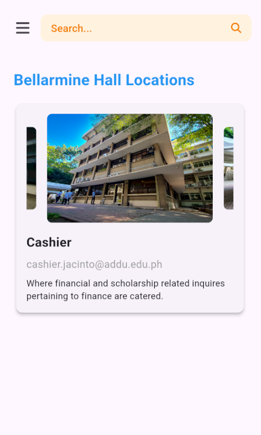

# **UniCamp** 🗺️  

Welcome to **UniCamp**, a campus map application tailored for the **Ateneo de Davao University (AdDU)**. UniCamp allows students, teachers, and guests to seamlessly view and navigate the Jacinto Campus with ease.  

---

## **Overview** 🌟  

UniCamp is designed to enhance campus navigation and provide a user-friendly experience for everyone visiting AdDU. Developed with **Flutter** and **Dart**, UniCamp integrates robust technologies to deliver a responsive and feature-rich application.  

Developed by:
- **Dominic Miguel D. Almonte**
- **Josh Elizalde A. Banggud**

---

## **Features** ✨  
- **Interactive Map**: Explore the Jacinto Campus with a detailed and responsive map.  
- **Firebase Integration**: Utilize real-time data for authentication, storage, and more.  
- **Social Login**: Google Sign-In for easy access.  
- **Responsive UI**: Optimized for various devices, ensuring a seamless user experience.  
- **Dynamic Elements**: Includes a carousel slider for showcasing campus highlights.  

---

## **Tech Stack** 💻  
UniCamp is built using the following technologies and plugins:  

### **Framework**  
- **Flutter** + **Dart**  

### **Plugins**  
| Plugin                     | Version     | Description                                                                 |
|----------------------------|-------------|-----------------------------------------------------------------------------|
| `firebase_core`            | ^3.8.0      | Core Firebase functionalities.                                             |
| `firebase_core_web`        | ^2.18.1     | Firebase core for web integration.                                         |
| `cloud_firestore`          | ^5.5.0      | Real-time database functionalities.                                        |
| `cloud_firestore_web`      | ^4.3.4      | Firestore integration for web.                                             |
| `firebase_storage`         | ^12.3.6     | Cloud storage solutions.                                                   |
| `font_awesome_flutter`     | ^10.8.0     | FontAwesome icons for a beautiful UI.                                      |
| `firebase_auth`            | ^5.3.3      | Firebase authentication for secure login.                                  |
| `google_sign_in`           | ^6.2.2      | Easy integration of Google sign-in.                                        |
| `provider`                 | ^6.1.2      | State management for a seamless app flow.                                  |
| `firebase_ui_oauth_google` | ^1.4.0      | Pre-built UI for Google OAuth integration.                                 |
| `flutter_map`              | ^7.0.2      | Interactive map functionalities.                                           |
| `latlong2`                 | ^0.9.1      | Latitude/longitude utilities for mapping.                                  |
| `carousel_slider`          | ^5.0.0      | Elegant carousel sliders for image display.                                |

---

## **Screenshots** 💻  

